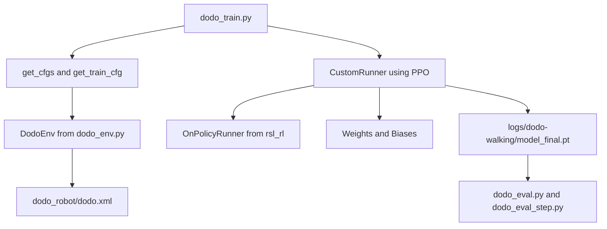

# 🦤 Dodo Genesis RL — Bird-like Biped Locomotion in Genesis

[](https://wandb.ai/suyourice-technical-university-of-munich/dodo-birdlike-gait)

This project implements **reinforcement learning–based bird-like walking control** for the Dodo robot,  
using the [Genesis](https://github.com/Genesis-Embodied-AI/Genesis) physics engine and `rsl_rl`.

The system is modular, GPU-accelerated (Metal/CUDA), and fully configurable for research in **bio-inspired locomotion**.

---

## 🧭 Project Overview

| File / Folder | Description |
|----------------|--------------|
| `dodo_train.py` | Main training script (multi-stage PPO with WandB logging). |
| `dodo_env.py` | Environment definition — physics setup, observation space, reward shaping. |
| `dodo_eval.py` | Evaluate trained models with or without viewer. |
| `dodo_eval_step.py` | Step-by-step rollout visualization for debugging. |
| `import_robot.py` | Imports the MJCF robot model into Genesis. |
| `dodo_robot/` | MJCF + mesh data of the Dodo robot. |
| `logs/` | Stores training results, plots, configs, and checkpoints. |
| `output.log` (auto-generated) | Stores full terminal output for each experiment in its respective `logs/<exp_name>/` directory. |

---

## ⚙️ Environment Structure (`dodo_env.py`)

The `DodoEnv` class defines the physics-based simulation environment for reinforcement learning.

### Key Features:
- **Genesis Scene**: built via `gs.Scene(show_viewer=False)`  
  → Supports Metal (macOS), CUDA (Linux), or CPU fallback.
- **Robot Import**: uses `dodo_robot/dodo.xml` (MJCF model).
- **Action Space**: 8 joints (hips, thighs, knees, ankles).
- **Observation Space**:  
  Linear velocity, angular velocity, DOF positions/velocities, and target commands.
- **Reward Components**:
  | Category | Terms |
  |-----------|--------|
  | Tracking | `tracking_lin_vel`, `tracking_ang_vel` |
  | Stability | `orientation_stability`, `base_height` |
  | Gait shaping | `periodic_gait`, `bird_hip_phase`, `foot_swing_clearance` |
  | Efficiency | `energy_penalty`, `action_rate` |
  | Penalties | `fall_penalty`, `lateral_drift_penalty`, `hip_abduction_penalty` |
- **Termination Conditions**: roll or pitch > 30°.
- **Latency Simulation**: optional (realistic actuator delay).

This environment is fully compatible with Genesis’ vectorized simulation —  
allowing thousands of parallel robots for faster PPO rollout.

---

## 🧠 Training Script (`dodo_train.py`)

This script trains the Dodo robot’s locomotion policy using **Proximal Policy Optimization (PPO)**.

### Workflow Overview
1. **Initialize WandB + Genesis**
   ```python
   wandb.init(project="dodo-birdlike-gait", name=args.exp_name)
   gs.init(backend="metal", show_viewer=False)
    ```
2.	**Load configurations**
•	`get_cfgs()` → environment setup (actions, rewards, targets)
•	`get_train_cfg()` → PPO hyperparameters and optimization setup

3.  **Stage-based Curriculum Learning**

    The training process increases target walking speed in multiple stages for stable gait learning.

    | Stage | Target Speed (m/s) | Saved Model |
    |:------:|:-----------------:|:-------------|
    | 1 | 0.1 | `model_stage1.pt` |
    | 2 | 0.3 | `model_stage2.pt` |
    | 3 | 0.4 | `model_stage3.pt` |
    | 4 | 0.5 | `model_final.pt` |


4.  **Training Loop**

- Uses a custom `CustomRunner` class that extends `OnPolicyRunner`
- Handles rollout collection, PPO updates, and metric logging
- Periodically saves checkpoints and visual summaries


5.  **Logging and Visualization**

- Automatically syncs results to **Weights & Biases (W&B)**
- Saves `metrics.png` every 100 iterations
- Configuration and checkpoints are stored under `logs/<exp_name>/`

6.  **Output Log Saving**

- All terminal outputs (stdout + stderr) are automatically redirected and saved under:  
  **`logs/<exp_name>/output.log`**

- This ensures that every experiment run can be fully reviewed later, including warnings, iteration summaries, and debug prints.

---

## ⚙️ PPO Configuration

| Parameter | Description | Default |
|------------|--------------|----------|
| `clip_param` | PPO clipping range | `0.2` |
| `entropy_coef` | Entropy regularization weight | `0.02` |
| `gamma` | Discount factor | `0.98` |
| `lam` | GAE λ | `0.95` |
| `learning_rate` | PPO learning rate | `0.0002` |
| `max_grad_norm` | Gradient clipping | `1.0` |
| `num_learning_epochs` | PPO update epochs per iteration | `8` |
| `num_mini_batches` | Number of PPO minibatches | `4` |
| `num_steps_per_env` | Steps collected before PPO update | `96` |
| `save_interval` | Checkpoint save frequency | `50` |
| `actor_hidden_dims` | Policy network layers | `[512, 256, 128]` |
| `critic_hidden_dims` | Value network layers | `[512, 256, 128]` |

---

## 💻 Command-Line Arguments

You can modify runtime parameters without editing code.

| Option | Type | Default | Description |
|--------|------|----------|-------------|
| `-e`, `--exp_name` | `str` | `"dodo-walking"` | Experiment/logging name |
| `-B`, `--num_envs` | `int` | `4096` | Number of parallel environments |
| `--max_iterations` | `int` | `2500` | PPO total iterations |
| `--backend` | `str` | `"metal"` | Override backend (`metal`, `cuda`, `cpu`) |

---

## 🧾 Save Terminal Output to File

To automatically save all console output to a log file during training,  
you can modify the launch command **or integrate it directly into the script**.

### ✅ Option 1 — Command-line redirection (simple)
Use this when launching training:

```bash
python dodo_train.py -e dodo_walking -B 512 --max_iterations 1000 \
  > logs/dodo-walking/output.log 2>&1
```

This saves both standard output and error messages to:

`logs/dodo-walking/output.log`

Add these lines right after log_dir = f"logs/{args.exp_name}":

```python
# --- Save terminal output to file ---
import sys
log_path = os.path.join(log_dir, "output.log")
sys.stdout = open(log_path, "w")
sys.stderr = sys.stdout
print(f"[Logging] Redirecting output to {log_path}")
```

This ensures every run automatically records all logs inside its own experiment folder.

💡 Tip: You can view training progress in real time while still saving logs using:

```bash
python dodo_train.py -e dodo_walking | tee logs/dodo-walking/output.log
```

### 💡 Optional: Compress Large Logs

If your training runs are long, `output.log` can become very large (hundreds of MB).  
You can compress it after training finishes to save disk space:

```bash
gzip logs/<exp_name>/output.log
```

This will create a smaller file:

`logs/<exp_name>/output.log.gz`

You can view it later without decompressing by running:

```bash
zcat logs/<exp_name>/output.log.gz | less
```

✅ Tip: Add this line to the end of your training script if you want automatic compression after training completes:

```python
os.system(f"gzip {os.path.join(log_dir, 'output.log')}")
print(f'[Logging] Compressed output.log → output.log.gz')
```

---

### Example usage:
```bash
python dodo_train.py -e "bird_gait_v2" -B 1024 --max_iterations 1500
```

or 

```bash
python dodo_eval_step.py --model logs/dodo-walking/model_stage2.pt
```

These arguments directly affect simulation parallelism, training duration, and device utilization.

---

## 📊 Logging & Monitoring

All training data is automatically stored and visualized.

| Location | Contents |
|-----------|-----------|
| 🌐 **Weights & Biases (W&B)** | Real-time PPO metrics, rewards, plots |
| 🖼 **`logs/<exp_name>/metrics.png`** | Local matplotlib plots |
| 🧾 **`logs/<exp_name>/cfgs.pkl`** | Serialized environment & PPO configs |
| 💾 **`logs/<exp_name>/model_*.pt`** | Checkpoints per stage |

### Example WandB Dashboard:
🔗 [View Example Run](https://wandb.ai/suyourice-technical-university-of-munich/dodo-birdlike-gait)

### Local file example:

```bash
logs/dodo-walking/
├── cfgs.pkl
├── metrics.png
├── model_stage1.pt
├── model_stage2.pt
├── model_stage3.pt
└── model_final.pt
```

---

## 🧪 Evaluation & Debugging Scripts

### `dodo_eval.py`
- Loads trained models (`.pt`).
- Runs simulation in Genesis (optionally with GUI).
- Useful for gait visualization and testing trained policies.

### `dodo_eval_step.py`
- Steps the policy manually for each timestep.
- Prints detailed observations, actions, and rewards.
- Designed for debugging and understanding PPO behavior.

---

## 🦾 Robot Definition

- The Dodo robot is defined via MJCF (`dodo_robot/dodo.xml`).
- Contains 8 actuated joints:
  - 2 hips (AA)
  - 2 thighs (FE)
  - 2 knees (FE)
  - 2 ankles (FE)
- `import_robot.py` loads this into Genesis as a `RigidEntity`.

### Joint Naming Convention:
| Joint | Description |
|--------|--------------|
| `Left_HIP_AA`, `Right_HIP_AA` | Abduction/Adduction |
| `Left_THIGH_FE`, `Right_THIGH_FE` | Thigh Flexion/Extension |
| `Left_KNEE_FE`, `Right_SHIN_FE` | Knee/Lower Leg motion |
| `Left_FOOT_ANKLE`, `Right_FOOT_ANKLE` | Ankle joint control |

---

## 🧩 Project Flow Summary



---

## 🚀 Example Usage

### Training
```bash
python dodo_train.py -e dodo_walking -B 512 --max_iterations 1000
```

### Evaluation

```bash
python dodo_eval.py --model logs/dodo-walking/model_final.pt
```

### Step Debugging

```bash
gs.init(backend="metal", show_viewer=False)
torch.set_default_device("mps")  # ensure all tensors on GPU
```

### For macOS Metal (GPU)

```python
gs.init(backend="metal", show_viewer=False)
torch.set_default_device("mps")  # ensure all tensors on GPU
```

Genesis automatically uses Metal (mps:0) on Apple Silicon —
check logs for:

```bash
device='mps:0'
[Genesis] [INFO] Running on backend gs.metal
```

---

## 📈 Results Preview

| Metric | Value |
|--------|--------|
| Final mean reward | ~2.7 |
| Training time (M4 Pro, 16 envs) | ~4 min |
| Target speed achieved | 0.5 m/s |

🖼 Example gait video and WandB metrics available at:  
[Weights & Biases Run](https://wandb.ai/suyourice-technical-university-of-munich/dodo-birdlike-gait)

---

## 📚 Dependencies & Installation

| Package | Version | Role |
|----------|----------|------|
| `genesis` | ≥0.3.4 | Physics engine |
| `rsl-rl-lib` | 2.2.4 | PPO + RL utilities |
| `torch` | ≥2.1 | Neural network backend (MPS/CUDA) |
| `wandb` | ≥0.22 | Experiment tracking |
| `matplotlib` | | Visualization |
| `numpy`, `pickle`, `argparse` | | Core utilities |

* Recover Environment
  ```bash
  pip freeze > requirements.txt
  pip install -r requirements.txt
  ```

### Installation Example
```bash
conda create -n genesis python=3.12
conda activate genesis
pip install git+https://github.com/Genesis-Embodied-AI/Genesis.git
pip install rsl-rl-lib==2.2.4 wandb matplotlib numpy
```

---

## 🏁 Citation

If you use this codebase or reproduce this training setup:

@software{su_dodo_genesis_rl_2025,
author = {Su, You-Ri},
title = {Dodo Genesis RL: Bird-like Locomotion via PPO in Genesis},
year = {2025},
institution = {Technical University of Munich},
repository = {https://github.com/suyourice/dodo_Genesis_RL}
}

---

### Author
👩‍💻 **You-Ri Su**  
M.Sc. Robotics, AI, and Control — Technical University of Munich  
Project: _Bio-Inspired Bipedal Locomotion with Genesis Physics_
(Dodo Alive!)


